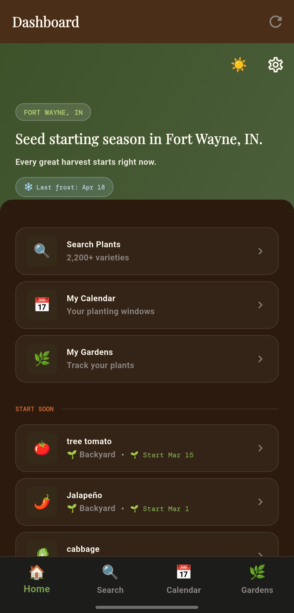
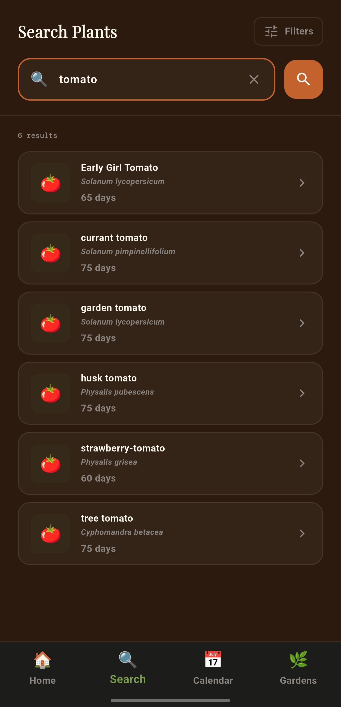
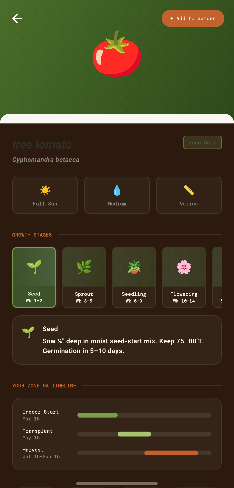
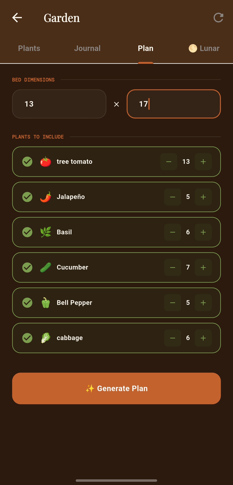
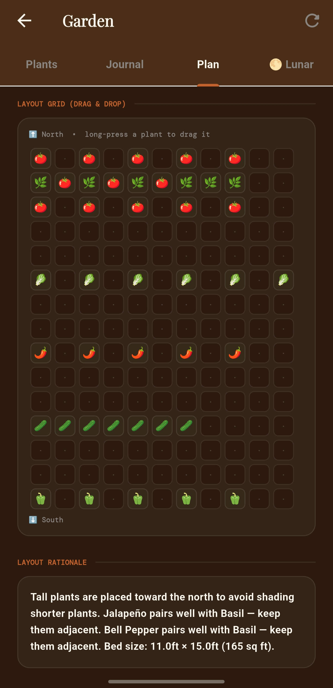
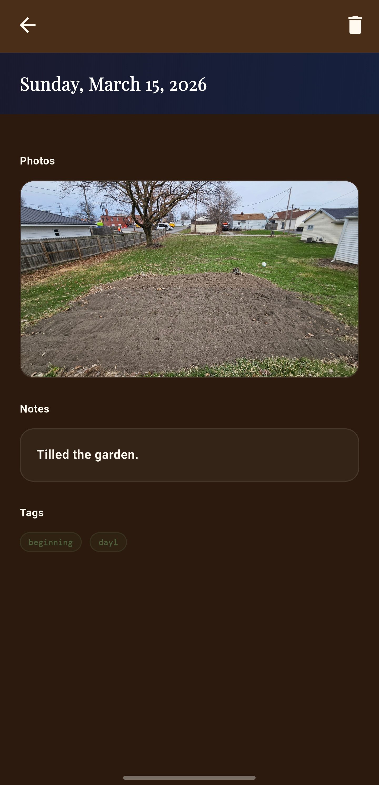

# OmniGarden 🌱
A mobile gardening app for Midwest US gardeners. Plan your garden, track your plants, and get personalized planting calendars based on your USDA hardiness zone.

**Version:** 1.0.0 Beta  
**Platform:** Android  
**Developer:** James Sutherland (AllTechGuru)  
**Contact:** guru_morgan@atguru.xyz

## Download
[⬇️ Download OmniGarden Beta APK](https://github.com/ATGuru/omnigarden/releases/download/v1.0.0-beta/app-release.apk)

## Screenshots

  
  
  
  
  
  

## Features
- 🌿 Plant encyclopedia with 2,200+ vegetables, herbs, fruits, and flowers
- 🗓 Personalized planting calendar based on your ZIP code and hardiness zone
- 🏡 Garden planner with drag-and-drop square-foot grid layout
- 📔 Garden journal with photo and video support
- 📤 Export garden plans and calendars as PDF
- 🔔 Planting and harvest reminders via push notifications
- 🌙 Lunar gardening calendar
- 🔒 Secure cloud sync via Supabase

## Tech Stack
- Flutter 3.41.4
- Riverpod (state management)
- Supabase (database, auth, storage)
- go_router (navigation)
- freezed (data classes)

## Target Regions
Optimized for Midwest US gardeners — USDA hardiness zones 5a through 7b.

## Privacy Policy
https://atguru.github.io/omnigarden-privacy/

## License
Copyright (c) 2026 James Sutherland. All Rights Reserved. See LICENSE for details.
